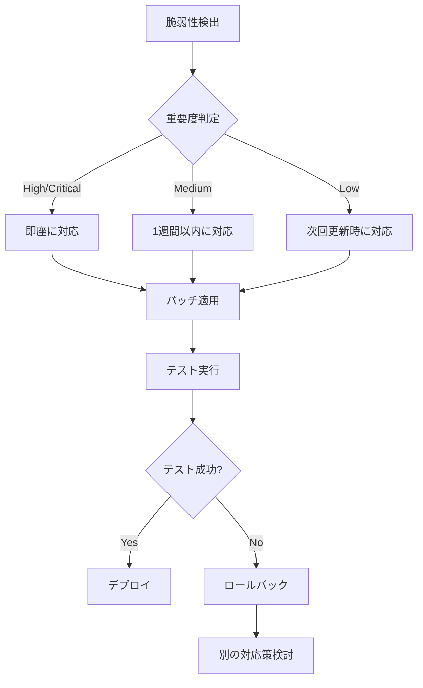

# 🔐 セキュリティレポート

**作成日**: 2025年11月8日  
**プロジェクト**: my-project  
**Phase**: Phase 5 - Task 5.8

---

## 📋 目次

1. [概要](#概要)
2. [セキュリティスキャン結果](#セキュリティスキャン結果)
3. [導入したセキュリティ対策](#導入したセキュリティ対策)
4. [推奨される運用](#推奨される運用)
5. [今後の改善計画](#今後の改善計画)

---

## 概要

このレポートは、Phase 5のTask 5.8（セキュリティチェック）で実施したセキュリティ評価の結果をまとめたものです。

### スキャン対象

- **依存関係**: Python パッケージ（requirements.txt、pyproject.toml）
- **ソースコード**: life_insurance、pension_calc、investment_simulation、common

### 使用ツール

- **Safety**: Python パッケージの既知の脆弱性スキャン
- **Bandit**: Python コードのセキュリティ問題スキャン
- **Dependabot**: 依存関係の自動更新

---

## セキュリティスキャン結果

### 1. Safety（依存関係の脆弱性）

**スキャン日時**: 2025年11月8日

**結果**: ✅ **脆弱性なし**

```json
{
  "vulnerabilities": [],
  "affected_packages": {}
}
```

**評価**:
- すべての依存パッケージに既知の脆弱性は検出されませんでした。
- 主要パッケージのバージョンは最新または十分に更新されています。

**主要パッケージバージョン**:
- streamlit: 1.50.0（最新）
- pandas: 2.3.2
- numpy: 2.3.3
- matplotlib: 3.10.6
- pytest: 8.4.2

### 2. Bandit（コードセキュリティ）

**スキャン日時**: 2025年11月8日

**結果**: ⚠️ **576件の低重要度問題**

**重要度別サマリー**:
- **High**: 0件
- **Medium**: 0件
- **Low**: 576件

**詳細分析**:

| 問題タイプ | 件数 | 重要度 | 説明 | 対応 |
|------------|------|--------|------|------|
| **B101: assert_used** | 575件 | Low | テストコード内のassert文 | ✅ 許容（テストコードのため） |
| **B112: try_except_continue** | 1件 | Low | try-except-continue構文 | ✅ 許容（エラーハンドリング意図通り） |

**評価**:
- **Medium以上の問題は0件**で、深刻なセキュリティリスクはありません。
- 検出された問題のほとんどはテストコード内の`assert`文で、誤検知です。
- 1件の`try_except_continue`は意図的なエラーハンドリングで、問題ありません。

**スキャン対象コード量**:
- 総行数: 16,112行
- スキップ行数（#nosec）: 0行

---

## 導入したセキュリティ対策

### 1. 自動セキュリティスキャン（GitHub Actions）

**ファイル**: `.github/workflows/security.yml`

**機能**:
- ✅ プッシュ時の自動スキャン（main、developブランチ）
- ✅ プルリクエスト時の自動スキャン
- ✅ 週次スケジュールスキャン（毎週月曜日 午前9時JST）
- ✅ 手動実行（workflow_dispatch）

**スキャン内容**:
1. **Safety**: 依存関係の脆弱性チェック
2. **Bandit**: コードセキュリティチェック（Medium以上のみ）
3. **レポート生成**: JSON形式でArtifactsに保存（30日間保持）
4. **サマリー表示**: GitHub Actions UIに結果を表示

### 2. Dependabot（依存関係自動更新）

**ファイル**: `.github/dependabot.yml`

**機能**:
- ✅ 週次の依存関係チェック（毎週月曜日 午前9時JST）
- ✅ セキュリティアップデートの自動PR作成
- ✅ パッケージのグループ化（データ分析、Streamlit、テスト、開発ツール）
- ✅ GitHub Actionsの自動更新

**グループ化設定**:
```yaml
groups:
  data-analysis:  # pandas, numpy, matplotlib, seaborn, plotly
  streamlit:      # streamlit, watchdog
  testing:        # pytest*, coverage
  dev-tools:      # black, flake8, mypy, safety, bandit
```

### 3. セキュリティポリシー（推奨）

今後作成を推奨する設定:

1. **SECURITY.md**: セキュリティ脆弱性の報告方法
2. **.github/SECURITY.md**: GitHubセキュリティタブに表示
3. **secrets.toml**: 機密情報の管理（.gitignoreで除外済み）

---

## 推奨される運用

### 定期的な確認

| 頻度 | タスク | 担当 |
|------|--------|------|
| **毎週** | GitHub Actionsのセキュリティスキャン結果確認 | 開発者 |
| **毎週** | Dependabotの自動PRレビュー | 開発者 |
| **毎月** | 依存関係の手動レビュー（`pip list --outdated`） | 開発者 |
| **四半期** | セキュリティポリシーの見直し | プロジェクトリーダー |

### 脆弱性対応フロー



### セキュリティベストプラクティス

1. **依存関係**:
   - ✅ 最小限の依存関係のみを使用
   - ✅ 定期的なアップデート
   - ✅ 脆弱性スキャンの自動化

2. **コード**:
   - ✅ ハードコードされた機密情報の禁止
   - ✅ 入力値の検証
   - ✅ 適切なエラーハンドリング

3. **CI/CD**:
   - ✅ セキュリティスキャンの自動化
   - ✅ テストの強制実行
   - ✅ レビュープロセスの確立

---

## 今後の改善計画

### 短期（1-3ヶ月）

- [ ] **SECURITY.md作成**: セキュリティ脆弱性の報告方法を文書化
- [ ] **コードサイニング**: リリース時の署名検証
- [ ] **SBOMの生成**: Software Bill of Materials（依存関係リスト）

### 中期（3-6ヶ月）

- [ ] **Secretsスキャン**: GitGuardian または TruffleHog の導入
- [ ] **ライセンスチェック**: 使用パッケージのライセンス互換性確認
- [ ] **セキュリティ監査**: 外部専門家によるコードレビュー

### 長期（6-12ヶ月）

- [ ] **SAST/DAST**: 静的/動的アプリケーションセキュリティテスト
- [ ] **ペネトレーションテスト**: 定期的なセキュリティ診断
- [ ] **セキュリティトレーニング**: 開発チームの教育プログラム

---

## 付録

### A. セキュリティツール比較

| ツール | 用途 | 無料プラン | GitHub統合 | 推奨度 |
|--------|------|-----------|------------|--------|
| **Safety** | 依存関係脆弱性 | ✅ Yes | ✅ Yes | ⭐⭐⭐⭐⭐ |
| **Bandit** | コードセキュリティ | ✅ Yes | ✅ Yes | ⭐⭐⭐⭐⭐ |
| **Dependabot** | 依存関係更新 | ✅ Yes | ✅ Yes | ⭐⭐⭐⭐⭐ |
| **Snyk** | 総合的なセキュリティ | ✅ Yes (制限あり) | ✅ Yes | ⭐⭐⭐⭐ |
| **GitGuardian** | Secrets スキャン | ✅ Yes (制限あり) | ✅ Yes | ⭐⭐⭐⭐ |
| **CodeQL** | 高度なコード分析 | ✅ Yes (OSS) | ✅ Yes | ⭐⭐⭐⭐ |

### B. 関連リンク

- [Safety公式ドキュメント](https://pyup.io/safety/)
- [Bandit公式ドキュメント](https://bandit.readthedocs.io/)
- [Dependabotドキュメント](https://docs.github.com/ja/code-security/dependabot)
- [OWASP Top 10](https://owasp.org/www-project-top-ten/)
- [CWE（共通脆弱性タイプ一覧）](https://cwe.mitre.org/)

### C. 緊急連絡先

**セキュリティインシデント発生時**:
1. プロジェクトリーダーに連絡
2. `.github/SECURITY.md`の手順に従って報告
3. 影響範囲の特定と緊急パッチの適用

---

**レポート作成者**: AI Agent (GitHub Copilot)  
**承認者**: （承認後に記入）  
**次回レビュー予定**: 2026年2月8日（3ヶ月後）
