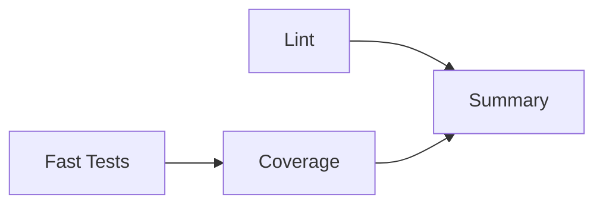

# コントリビューションガイド

my-projectへのコントリビューションありがとうございます！このガイドでは、開発に参加するための手順とベストプラクティスを説明します。

## 📋 目次

- [開発環境のセットアップ](#開発環境のセットアップ)
- [テストの実行](#テストの実行)
- [コーディング規約](#コーディング規約)
- [プルリクエストの作成](#プルリクエストの作成)
- [CI/CDパイプライン](#cicdパイプライン)

---

## 🚀 開発環境のセットアップ

### 必要要件

- Python 3.12以上
- Git
- VSCode（推奨）

### セットアップ手順

基本セットアップ手順は `README.md` を正本とします。

- 仮想環境の有効化
- `pip install -e .`
- 統合ランチャー / 個別起動の基本手順

このガイドでは、コントリビューション時に追加で必要な開発ツールのみを扱います。

```bash
pip install pytest pytest-cov pytest-xdist black isort flake8 mypy
```

---

## 🧪 テストの実行

共通の起動・基本テスト手順は `README.md` を正本とします。  
この節では、開発時に使う差分確認向けのコマンドだけを記載します。

### クイックテスト（開発中）

```powershell
# 推奨: PowerShellスクリプト使用
.\run_tests.ps1 fast
```

**実行時間**: ~4秒  
**用途**: コード変更後の即座な検証

### カバレッジ測定（コミット前）

```powershell
# 推奨: PowerShellスクリプト使用
.\run_tests.ps1
```

**実行時間**: ~15秒  
**用途**: コミット前の最終確認

### HTMLレポート生成

```powershell
# 推奨: PowerShellスクリプト使用（自動でブラウザ起動）
.\run_tests.ps1 cov-html
```

**実行時間**: ~15秒  
**出力**: `htmlcov/index.html`

### テストオプション

```bash
# 特定のテストファイルのみ実行
pytest tests/test_pension_utils.py -v

# 特定のテストクラスのみ実行
pytest tests/test_pension_utils.py::TestPensionCalculator -v

# 特定のテスト関数のみ実行
pytest tests/test_pension_utils.py::TestPensionCalculator::test_calculate_future_pension -v

# 失敗したテストのみ再実行
pytest --lf

# 最も遅いテスト10件を表示
pytest --durations=10
```

---

## 📏 コーディング規約

### Python スタイルガイド

- **PEP 8**準拠
- **Black**でコードフォーマット
- **isort**でインポート整理
- **flake8**でリント
- **mypy**で型チェック（推奨）

### 自動フォーマット

```bash
# Blackでフォーマット
black .

# isortでインポート整理
isort .

# flake8でリント
flake8 common/ life_insurance/ pension_calc/
```

### 命名規則

- **関数・変数**: `snake_case`
- **クラス**: `PascalCase`
- **定数**: `UPPER_SNAKE_CASE`
- **プライベート**: `_leading_underscore`

### ドキュメント

- **docstring**: Google形式推奨
- **型ヒント**: 可能な限り使用
- **コメント**: 日本語OK（複雑なロジックのみ）

```python
def calculate_pension(age: int, contribution: float) -> dict[str, float]:
    """年金受給額を計算します。

    Args:
        age: 受給開始年齢（60-75歳）
        contribution: 総納付額（円）

    Returns:
        年間受給額、月額受給額を含む辞書

    Raises:
        ValueError: 年齢が範囲外の場合
    """
    if not 60 <= age <= 75:
        raise ValueError("年齢は60-75歳の範囲で指定してください")
    
    annual_amount = contribution * 0.02  # 例: 2%の年率
    return {
        "年間受給額": annual_amount,
        "月額受給額": annual_amount / 12,
    }
```

---

## 📚 ドキュメント配置ルール

- 現行仕様・運用ガイドは `docs/` に配置します。
- リファクタリングの計画・進捗・履歴は `REFACTORING/` に配置します。
- 旧版や退避資料は `archive/` に配置します。
- 同じ主題を複数場所に重複記載しないでください。
- 新しい恒久ドキュメントを追加する場合は、まず `docs/INDEX.md` から導線を追加してください。

### 実行導線の扱い

- 統合起動の正本は `main.py` です。
- 個別起動の正本は `scripts/` 配下のランナーです。
- README と docs の実行手順を更新する場合は、`main.py` / `scripts/` の実体と一致していることを確認してください。

---

## 🔀 プルリクエストの作成

### ブランチ戦略

- `main`: 本番環境（安定版）
- `develop`: 開発環境（次期リリース）
- `feature/*`: 新機能開発
- `fix/*`: バグ修正
- `refactor/*`: リファクタリング

### PR作成手順

1. **ブランチ作成**

```bash
git checkout -b feature/your-feature-name
```

2. **変更をコミット**

```bash
git add .
git commit -m "feat: 機能の説明"
```

3. **テストを実行**

```bash
.\run_tests.ps1
```

4. **プッシュ**

```bash
git push origin feature/your-feature-name
```

5. **GitHubでPR作成**

- ベースブランチ: `develop` または `main`
- テンプレートに従って記入
- レビュアーを指定

### コミットメッセージ規約

```
<type>(<scope>): <subject>

<body>

<footer>
```

**Type**:
- `feat`: 新機能
- `fix`: バグ修正
- `docs`: ドキュメント変更
- `style`: コードスタイル変更（機能変更なし）
- `refactor`: リファクタリング
- `test`: テスト追加・修正
- `chore`: ビルド・補助ツール変更

**例**:
```
feat(pension): 年金受給額計算機能を追加

- PensionCalculatorクラスを実装
- 国民年金・厚生年金の計算ロジックを追加
- 18件のテストを追加（100%パス）

Closes #123
```

---

## 🤖 CI/CDパイプライン

### パイプライン構成

my-projectのCI/CDは3つのジョブで構成されています：



#### 1. Lint（Code Quality Check）

**実行内容**:
- `flake8`: 構文エラーチェック
- `black`: コードフォーマット検証
- `mypy`: 型チェック（警告のみ）

**実行時間**: ~30秒

#### 2. Fast Tests

**実行内容**:
- 396件の全テストを実行
- カバレッジ測定なし

**実行時間**: ~4秒  
**目的**: PR時の即座なフィードバック

#### 3. Coverage Analysis

**実行内容**:
- カバレッジ測定付きテスト実行
- Codecovへのアップロード
- HTMLレポート生成

**実行時間**: ~15秒  
**目的**: 詳細な品質分析

### トリガー

CI/CDは以下のイベントで自動実行されます：

- `push` to `main` or `develop`
- `pull_request` to `main` or `develop`
- 手動実行（`workflow_dispatch`）

### PR時のチェック項目

PRをマージする前に、以下を確認してください：

- ✅ すべてのテストがパス
- ✅ カバレッジが低下していない（目標: 81.64%以上）
- ✅ Lintエラーがない（警告はOK）
- ✅ レビューが完了している

### ローカルでのCI検証

PR作成前にローカルでCIと同じ粒度のチェックを実行できます。  
基本テストコマンドは `README.md` を正本とし、ここでは CI 相当の補助チェックだけを示します。

```bash
# 1. Lint（Code Quality）
black --check --diff .
flake8 common/ life_insurance/ pension_calc/
mypy common/ life_insurance/ pension_calc/ || echo "Type errors (non-blocking)"
```

### CI/CD設定ファイル

- **ワークフロー**: `.github/workflows/ci.yml`
- **Coverage設定**: `.coveragerc`
- **Pytest設定**: `pyproject.toml` ([tool.pytest.ini_options])
- **Black設定**: `pyproject.toml` ([tool.black])
- **mypy設定**: `pyproject.toml` ([tool.mypy])

---

## 📊 パフォーマンス目標

### テスト実行時間

| 項目 | 目標 | 現状 |
|------|------|------|
| Fast Tests | 5秒以下 | ✅ 4.21秒 |
| Coverage Tests | 15秒以下 | ✅ 14.62秒 |
| CI Total | 30秒以下 | ✅ ~25秒 |

### カバレッジ目標

| モジュール | 目標 | 現状 |
|-----------|------|------|
| **全体** | 85% | 🟡 81.64% |
| pension_utils.py | 85% | ✅ 94.62% |
| withdrawal_optimizer.py | 85% | ✅ 86.67% |
| insurance_calculator.py | 90% | ✅ 91.59% |

---

## 🆘 トラブルシューティング

### テストが失敗する

```bash
# 詳細なエラー情報を表示
pytest -v --tb=short

# 特定のテストのみデバッグ
pytest tests/test_pension_utils.py::test_calculate_future_pension -vv
```

### カバレッジが低い

```bash
# HTMLレポートで詳細確認
.\run_tests.ps1 cov-html
```

### Lint エラー

```bash
# 自動修正
black .
isort .

# 手動で修正が必要なエラーを確認
flake8 common/ life_insurance/ pension_calc/
```

---

## 📝 その他のリソース

- **Phase 7完了レポート**: `PHASE_7.3_COMPLETION_REPORT.md`
- **テストスクリプト**: `run_tests.ps1`, `Makefile`
- **プロジェクト構造**: `README.md`

---

## 🤝 コントリビューター

このプロジェクトに貢献してくださったすべての方に感謝します！

---

**質問や提案がある場合は、Issueを作成してください。**
